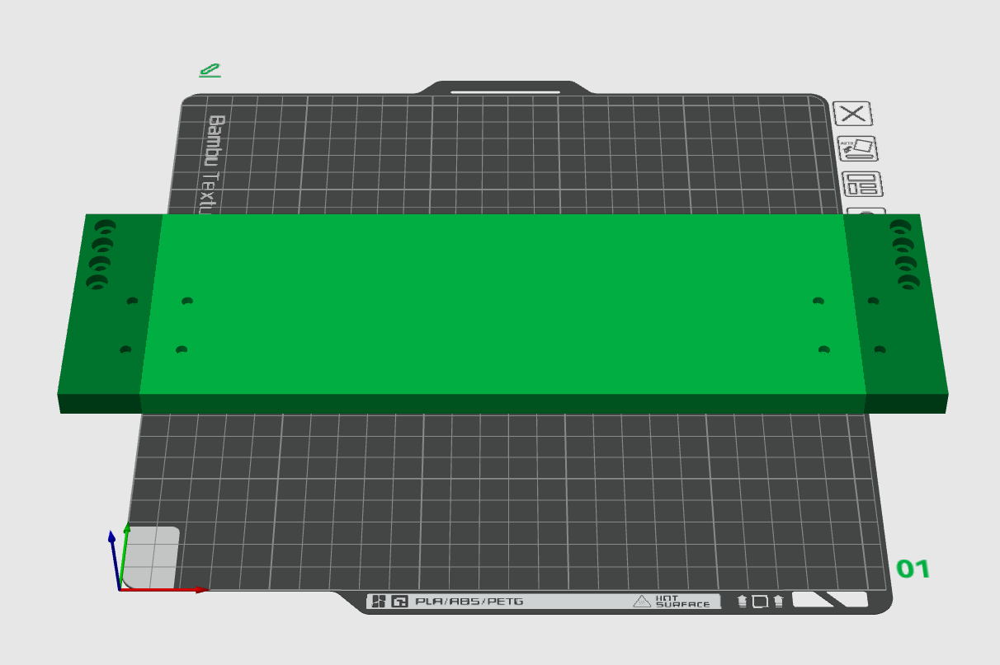
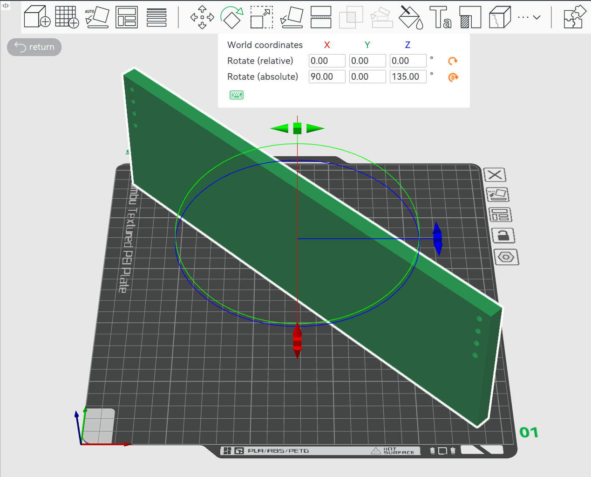
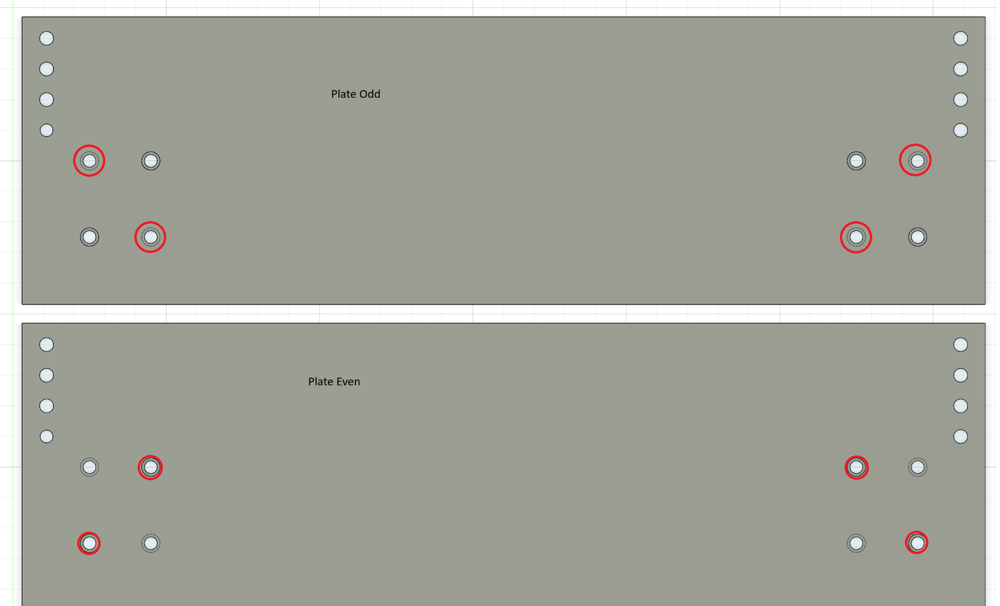

# MOZA racing base plate foot rest
I found myself having a difficulty using MOZA racing CRP2+mBoost pedal when I first got it. I have pretty small foot and the height of the pedeal plate and the action was not comfortable at all for my small foot. After some fiddling around I created models that can help me adjust the foot rest height.

The models have 1cm in height so you can easily increse the height by printing more plates. Because the bolt hole of the MOZA racing base plate is M4, you need at least M4x10mm bolt to secure the riser base plate. Each layer you add requires 4pcs of M3 heat insert and 4 pcs of M3x10mm. I initially wanted to match all screws to M4s but I did not have M4 heat inserts and extra screws so it must do with M3s.

If you decided to use the foot rest, a > shaped metal bar, you need additional 2 pcs of M3 heat inserts and 2 pcs of M3 screws. Note that this heat insert recieves enourmous pressure from the foot if you lean your foot on it. I would like to suggest to use longest possible heat inserts for this and matching screw to have more surface for the mechanical parts to bite to each other.

# Printing
I used BambuLabs P1S's default settings for Generic PLA, and Soleyin PLA filament. When the model is put on to the slicer, you will find that the model does not really fit.

However, you can rotate the model then it will be perfectly fine to be printed in P1S. You can add 90 to X-axis and 135 to Z-axis.
 

you can do up to 4 plates at the same time.

# Assembly
The riser top can be flip to have different hole pattern for assembly. You can stack a plate on top of another and hold them down. You can use the holes criss-corss pattern to keep stack up. The bottom plate should have heat inserts for matching holes for the plate going on top of them.

Heat inserts for the holes with red circles. Of course you need to flip the plates for odd and even.

